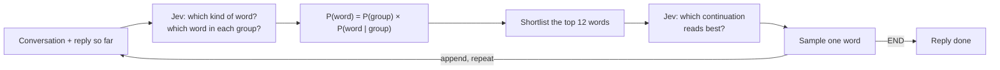

# JevGPT

*Autoregressive text, written by a model that doesn't write.*

For years we've inappropriately pointed billion-parameter autoregressive transformers meant to write sequences of words at problems that are really multiple choice. 

Is this email spam? What tool should be used? Generate a few hundred tokens of step-by-step reasoning, then fish a "yes" out of the last line.

It's time to return the favor, by using a model meant to make choices, to write sequences of words.

[Jev](https://typesafe.ai/blog/introducing-system-one-models-and-jev), from TypeSafe AI, is a *System One* model built to make choices. Give it a situation and a list of options, and it returns a calibrated probability for each one in milliseconds, for a fraction of a cent. 

So naturally, we made it write.

JevGPT is a ChatGPT-style chat app where every word of every reply is a multiple-choice question. Jev picks a word, we append it, and Jev picks again: autoregressive generation, one decision at a time. The same trick the big models use, just with a model that was never meant for it.

## Demo

<!--
  VIDEO PLACEHOLDER
  To embed the demo: edit this file on GitHub, drag an .mp4 or .mov into the editor where this
  comment is, and GitHub will insert a user-attachments URL on its own line, which renders as an
  inline video player. Then delete this comment and the placeholder line below.
-->

https://github.com/user-attachments/assets/59c63de4-ea2a-4d66-bb7d-8759d7702403

## Try it yourself
Use the [live demo](https://curata.com/jevgpt) (requires TypeSafe API key) or clone this repo and run it locally.

## How it works

### The loop

Every reply is built one word at a time:

1. JevGPT sends Jev the conversation and the reply so far, and asks which word comes next.
2. Jev returns a probability for every word in a fixed vocabulary of ~1,800 words, plus a special **END** option.
3. JevGPT samples a word from those probabilities, streams it to your screen, and appends it to the reply.
4. Repeat until Jev picks END or the reply hits the length limit.



### Squeezing a vocabulary into 255 options

A Jev multiple-choice question can have at most **255 options**, far fewer than you need to say anything interesting. So the vocabulary in [`data/vocab.json`](data/vocab.json) is split into 14 groups of at most 255 words each: verbs, everyday nouns, adjectives, pronouns, punctuation, and so on.

Each step sends **one** request containing 15 questions:

- **Which kind of word comes next?** One option per group, plus END.
- **If it's a verb, which verb? If it's a noun, which noun? …** One question per group.

Jev answers them all at once, and the answers multiply into a single distribution over the whole vocabulary:

```
P("banana") = P(next word is an everyday noun) × P("banana" | everyday noun)
            =                0.30              ×              0.10          = 0.03
```

### Re-ranking: letting Jev judge, not guess

Word-by-word probabilities alone produce word salad. Jev turned out to be poor at predicting the next word in isolation, but excellent at judging a whole piece of text. So by default, JevGPT adds a second step to every word:

1. Take the 12 most likely words from the distribution above.
2. Ask Jev a second question whose options are the **full continuations**: *"My favorite fruit is"*, *"My favorite fruit I"*, *"My favorite fruit is [end of reply]"*, …
3. Sample from Jev's answer to that question instead.

This costs one extra request per word, so replies stream about twice as slowly, but it's the difference between *"I can can't apple"* and *"My favorite fruit is banana!"* (see [Does it work?](#does-it-work)). You can turn it off in **Settings**.

### Sampling

Before sampling, JevGPT applies the usual knobs: temperature, top-k, top-p, and a repetition penalty. It also applies a few hard rules: a reply can't start with punctuation, can't put two punctuation marks in a row, and can't repeat the previous word.

### The chat interface

- **Streaming:** replies appear word by word as Jev decides them, with a Stop button.
- **Look inside:** hover or tap any word to see the other words Jev considered and their probabilities.
- **Heatmap:** tints every word from green (Jev was confident) to red (a long shot).
- **Chat history:** a toggle under the chat box decides whether Jev sees earlier messages or only your latest one.
- **Settings:** your API key, re-ranking, and all the sampling knobs.

## Does it work?

Sort of, and that's the fun part. JevGPT includes an eval that generates replies to fixed prompts and has Jev grade them for fluency and relevance on a 0–4 scale. The eval first checks that Jev can tell good replies from word-shuffled and off-topic ones.

| Strategy | Fluency /4 | Relevance /4 |
|---|---|---|
| Word-by-word only | 2.56 | 2.90 |
| **With re-ranking (default)** | **3.17** | **3.31** |

These are small samples (5 prompts × 2 replies each), so treat them as directional. Some real replies:

| Prompt | Word-by-word only | With re-ranking |
|---|---|---|
| What is your favorite fruit? | I am is banana. | My favorite fruit is banana! |
| How do you pick your words? | I do doesn't do think can think I choosing… | Well I pick carefully because I think I'm careful. |
| How are you doing today? | I am good | I am doing fine thanks how are you. |

**Known limitations:**
- **It can only say words in its vocabulary.** If a word isn't among the ~1,800, JevGPT can't use it.
- **Replies are short and sometimes vague.** It will happily promise Python advice without giving any.
- **Re-ranking only chooses among the top 12 words.** If the right word isn't in that shortlist, it can't be picked.
- **It's slow for a chat app.** Each word takes two requests of roughly 70–500 ms.
- **Every request sends the entire vocabulary**, about 14,000 input tokens per word. At Jev's $0.042 per million input tokens, that's roughly a cent for a 20-word reply.

## Getting started

```bash
npm install
npm run dev
```

Open http://localhost:3000. The chat stays locked until you enter your own TypeSafe API key, so a public deployment never spends the server owner's credits. Get a key at [console.typesafe.ai](https://console.typesafe.ai/settings/keys) and paste it into the form (or **Settings**). The server checks the key with TypeSafe, then stores it in an httpOnly, SameSite=strict cookie scoped to `/api`. Page scripts can't read it back, and the browser sends it only to this app's server, which uses it to call TypeSafe. **Remove** clears it and locks the chat again.

To try the interface without a key, set `JEV_BACKEND=mock` in `.env.local` (`cp .env.local.example .env.local`) and restart. The chat then uses a **mock backend**, a small trigram model trained on sample replies, and ignores all keys. `TYPESAFE_DEFAULT_MODEL` pins a Jev version.

The server's `TYPESAFE_API_KEY` is only used by the command-line scripts, never by the chat. `npm run smoke` makes one real call and prints the top next words.

If you deploy this publicly, serve it over HTTPS so the cookie gets the `Secure` flag.

## Measuring coherence

`npm run eval` generates replies to the prompts in [`eval/prompts.json`](eval/prompts.json) under each named config in [`eval/configs.json`](eval/configs.json). It then asks Jev to grade every reply for **fluency** (0–4), **relevance** (0–4), and whether it ends as a complete sentence. It prints a comparison table and saves the full results and a Markdown summary to `eval/results/`.

To check the judge itself, it also grades each prompt's hand-written gold reply, a word-shuffled copy, and another prompt's gold reply. If Jev can't clearly separate the gold replies from those controls, the report warns that its scores aren't trustworthy.

```bash
npm run eval -- --samples 2                  # all configs; prints a max cost and asks first
npm run eval -- --configs default,rerank --prompts 5
npm run eval -- --generator mock --no-judge  # no API key needed
```

Evals spend real Jev credits. The script prints an upper-bound cost and asks before running. Add a config to `eval/configs.json` to try a new strategy (for example `{ "rerank": 24 }` for a bigger shortlist). Generation uses the same code as the app ([`lib/generate.ts`](lib/generate.ts)).

## Development

```bash
npm test             # vitest
npm run typecheck
npm run lint
npm run build
```

| Where | What |
|---|---|
| [`lib/generate.ts`](lib/generate.ts) | The word-by-word loop, shared by the chat and the eval |
| [`lib/backends/typesafe.ts`](lib/backends/typesafe.ts) | Building Jev's questions, combining answers, re-ranking |
| [`lib/sampling.ts`](lib/sampling.ts) | Temperature, top-k, top-p, repetition penalty, and the hard rules |
| [`app/api/chat/route.ts`](app/api/chat/route.ts) | Streams each word to the browser |
| [`components/`](components/) | The chat interface |
| [`lib/eval/`](lib/eval/), [`scripts/eval.ts`](scripts/eval.ts) | The coherence eval |

## Customizing the vocabulary

Edit [`data/vocab.json`](data/vocab.json). Words are space-separated per group. A group can hold at most 255 words, and a word may appear in more than one group (its probabilities are summed). `npm test` checks the limits.

Remember that every request sends the whole vocabulary, so a bigger vocabulary means more tokens, and more cost, per word.
